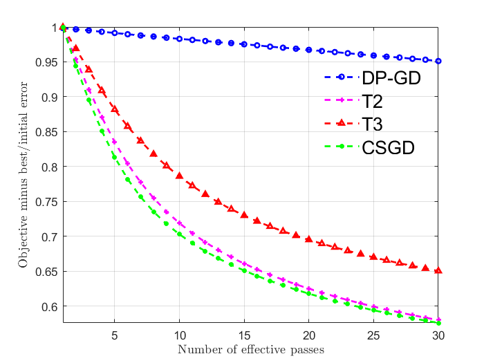

# Demo for Clipped-dpSGD

A demo for clipped-dpSGD proposed in *Efficient Private SCO for Heavy-Tailed Data via Clipping*.

## Usage

All algorithms are implemented in C++.

To run the demo in MATLAB, first run `mex_all` in the MATLAB terminal to generate the mex file. (Note that the compiler should support at least `c++11`)

Then, run `TEST` in the MATLAB terminal, a small demo training ridge and logistic regression with $\sigma=m=200$ using Adult dataset `a9a` from [LIBSVM Data](https://www.csie.ntu.edu.tw/~cjlin/libsvmtools/datasets/), to generate a plot with $\epsilon=2.0$ shown as below.

Test environment: ASUS FX50J machine with single Intel Core I7-4720HQ with 3.60GHz cores, 4GB RAM, Windows 10 with MinGW-w64 C/C++ Compiler, MATLAB R2021a.


>> TEST
Building with 'MinGW64 Compiler (C++)'.
MEX completed successfully.
Algorithm: DP_GD
Time: 7.381367 seconds 
Algorithm: T3
Time: 0.588528 seconds 
Algorithm: T2
Time: 0.578243 seconds
Algorithm: CSGD
Time: 0.552503 seconds  


``````
